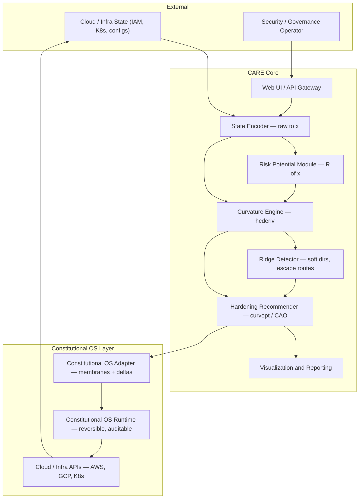

# CARE — Curvature-Aware Risk Engine

[](https://github.com/zetta55byte/care/actions/workflows/ci.yml)
[](https://pypi.org/project/care/)
[](LICENSE)
[](https://www.python.org/)
[](https://ghcr.io/zetta55byte/care)
[](https://doi.org/10.5281/zenodo.19394700)

---

## Why CARE exists

Modern infrastructure behaves like a dynamical system: it drifts, accumulates
misconfigurations, and can be pushed across boundaries into catastrophic states.
The **Unified Attractor Grammar** (UAG, [Byte 2026](https://doi.org/10.5281/zenodo.19394700))
shows that every such system has *attractors* (stable configurations), *ridges*
(basin boundaries), and *curvature* (the geometric structure that determines how
easy it is to fall into failure modes). Cyberattacks exploit exactly these
low-curvature escape routes — the soft directions where a system can be nudged
into instability with minimal effort.

CARE operationalises the UAG for cybersecurity:

| UAG concept | CARE component |
|---|---|
| Attractor A* | Current stable operating state |
| Ridge ∂B | Misconfiguration / breach boundary |
| Soft eigenvector (min \|λ\|) | Easiest privilege-drift or attack path |
| Theorem 3 — Hessian = local geometry | `curvature.py` eigendecomposition |
| Theorem 4 — min \|λ_min\| on ∂B = escape | `ridge.py` Kramers proxy + escape direction |
| Constitutional OS membranes | `membranes/policies.py` + `adapters/constitutional_os.py` |
| Reversible deltas | `membranes/deltas.py` with full audit log |

Instead of reacting to incidents, CARE **continuously stabilises** the system
against drift, adversarial pressure, and emergent vulnerabilities.

---

## Quick start

### Python

```bash
pip install -e ".[viz]"
python examples/iam_demo/run_demo.py --local
```

### Docker (fastest path to a running API)

```bash
docker compose up
curl -s -X POST localhost:8000/recommend \
  -H "Content-Type: application/json" \
  -d '{"state":{"user_count":42,"admin_users":5},"potential":"privilege"}' | python3 -m json.tool
```

### Docker + Jupyter notebook

```bash
docker compose --profile notebook up
# Open http://localhost:8888 — notebook.ipynb is pre-loaded
```

### Docker + mock Constitutional OS runtime

```bash
docker compose --profile full up
# CARE → API on :8000  |  Jupyter on :8888  |  mock COS on :9000
```

---

## Architecture



CARE is a **closed-loop stabiliser**: detect → analyse → harden → verify → repeat.

---

## API endpoints

| Method | Endpoint | Description |
|---|---|---|
| `GET` | `/health` | Liveness check |
| `POST` | `/encode` | Raw state → vector x ∈ ℝⁿ |
| `POST` | `/risk` | Scalar risk R(x) |
| `POST` | `/curvature` | ∇R, H(x), eigenstructure |
| `POST` | `/escape-route` | Softest direction + Kramers proxy |
| `POST` | `/recommend` | Prioritised hardening actions |
| `POST` | `/apply` | Push deltas into Constitutional OS |

Full OpenAPI docs at `http://localhost:8000/docs` when the server is running.

---

## Installation

```bash
# Minimal (NumPy backend only):
pip install care

# With visualisations:
pip install "care[viz]"

# With JAX + exact Hessians via hcderiv:
pip install "care[jax,hcderiv]"

# Everything:
pip install "care[all]"
```

**Requirements:** Python 3.10+, NumPy, FastAPI, Pydantic v2.
Optional: JAX/XLA + [hcderiv v0.4.0](https://zenodo.org/records/19433812);
boto3 and kubernetes-python for live adapters.

---

## Docker

### Build locally

```bash
docker build --target runtime -t care:0.1.0 .
docker run -p 8000:8000 care:0.1.0
```

### Pull from GHCR

```bash
docker pull ghcr.io/zetta55byte/care:0.1.0
docker run -p 8000:8000 ghcr.io/zetta55byte/care:0.1.0
```

### Compose profiles

| Command | Services started |
|---|---|
| `docker compose up` | `care` (API on :8000) |
| `docker compose --profile notebook up` | `care` + `notebook` (Jupyter on :8888) |
| `docker compose --profile full up` | `care` + `notebook` + `cos-runtime` (mock COS on :9000) |

### Environment variables

Copy `.env.example` to `.env` and edit:

```bash
cp .env.example .env
# Then: docker compose up
```

Key variables:

| Variable | Default | Description |
|---|---|---|
| `CARE_CURVATURE_BACKEND` | `numpy` | `numpy` / `jax` / `jax-xla` |
| `CARE_COS_ENABLED` | `false` | Enable live Constitutional OS |
| `CARE_COS_ENDPOINT` | `http://cos-runtime:9000` | COS Runtime URL |
| `CARE_SOFT_LAMBDA` | `1.0` | \|λ\| threshold for "soft direction" |
| `CARE_HIGH_RISK` | `10.0` | R(x) threshold for "high risk" |

---

## Configuration

All settings load from environment variables or `.env`:

```bash
CARE_CURVATURE_BACKEND=jax-xla   # exact Hessians via hcderiv
CARE_COS_ENABLED=true            # push deltas to live COS Runtime
CARE_COS_ENDPOINT=http://cos:9000
LOG_LEVEL=DEBUG
```

---

## Upgrade path: demo → production

| Stub | Production replacement |
|---|---|
| Generic dict encoder | `adapters/aws_iam.py` with `boto3` credentials |
| NumPy finite differences | `CARE_CURVATURE_BACKEND=jax-xla` + hcderiv installed |
| COS apply stub | `CARE_COS_ENABLED=true` + live COS Runtime |
| In-memory audit log | Swap `_AUDIT_LOG` in `membranes/deltas.py` for Redis/Postgres |

---

## Tests

```bash
pip install -e ".[dev]"
pytest tests/ -v
```

**55 tests, 55 passing** across all modules and all 7 API endpoints.
CI runs the full matrix on Python 3.10, 3.11, and 3.12 plus a Docker
build + smoke test on every push.

---

## Release workflow

```bash
# Tag and push → CI runs tests → builds PyPI package → pushes Docker image
git tag v0.1.0 && git push origin v0.1.0
```

On a version tag the CI pipeline:
1. Runs the full 3 × Python test matrix
2. Builds and smoke-tests the Docker image
3. Publishes to PyPI (OIDC trusted publishing — no API key needed)
4. Pushes `ghcr.io/zetta55byte/care:0.1.0` and `:latest` to GHCR

---

## Project structure

```
care/
├── care/
│   ├── config.py              settings (env / .env)
│   ├── models/
│   │   ├── state_encoder.py   raw state → x ∈ ℝⁿ
│   │   ├── risk_potential.py  R(x): quadratic / privilege / blast_radius
│   │   ├── curvature.py       ∇R, H(x), eigendecomp (numpy/jax/jax-xla)
│   │   ├── ridge.py           UAG Theorem 4: softest λ, Kramers proxy
│   │   └── recommend.py       5-rule hardening engine
│   ├── api/
│   │   ├── server.py          FastAPI: 7 endpoints + OpenAPI docs
│   │   └── schemas.py         Pydantic v2 schemas
│   ├── adapters/
│   │   ├── aws_iam.py         IAM encoder + boto3 stub
│   │   ├── k8s.py             K8s security posture encoder
│   │   └── constitutional_os.py  delta proposal, membrane check, apply
│   ├── membranes/
│   │   ├── policies.py        membrane rules (extensible)
│   │   └── deltas.py          Delta dataclass + audit log
│   └── viz/
│       └── plots.py           eigenvalue spectrum, basin, before/after, timeline
├── tests/
│   └── test_pipeline.py       55 tests
├── examples/
│   └── iam_demo/
│       ├── iam_state.json
│       ├── run_demo.py        --local or API mode
│       └── notebook.ipynb    interactive walkthrough (executed)
├── Dockerfile                 multi-stage, non-root, healthcheck
├── docker-compose.yml         care / notebook / cos-runtime profiles
├── .dockerignore
├── .env.example
├── .github/workflows/ci.yml   test matrix + Docker build + PyPI + GHCR
├── CHANGELOG.md
├── CONTRIBUTING.md
├── CODE_OF_CONDUCT.md
└── LICENSE
```

---

## References

- Byte, Z. (2026). *The Unified Attractor Grammar.*
  DOI: [10.5281/zenodo.19394700](https://doi.org/10.5281/zenodo.19394700)
- Byte, Z. (2026). *hcderiv v0.4.0 — JAX-XLA backend for exact one-pass Hessians.*
  DOI: [10.5281/zenodo.19433812](https://doi.org/10.5281/zenodo.19433812)
- Byte, Z. (2026). *Constitutional OS.* Preprint.
- Freidlin, M. & Wentzell, A. (2012). *Random Perturbations of Dynamical Systems.* Springer.
- Kramers, H. A. (1940). *Physica* **7**, 284–304.
