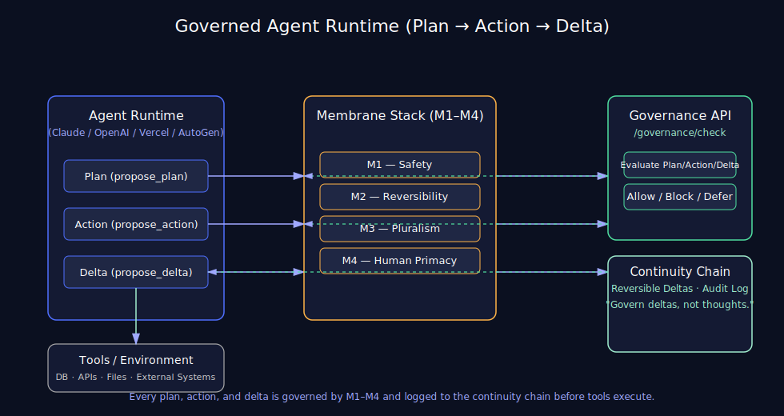

# Constitutional OS — Agent Runtime Integrations

> The model stays untouched. Governance becomes the runtime.



---

## The pattern

Every integration intercepts three stages:

```
Plan  → M1–M4 → allow / block / defer
Action → M1–M4 → allow / block / defer
Delta  → M1–M4 → allow / block / defer → continuity chain
```

The model never knows governance exists. It just sees tool calls that either execute, get blocked with a reason, or get deferred for human approval.

---

## Shared objects

All four integrations share the same `Constitution` and `ContinuityChain`:

```python
from integrations.constitution import Constitution
from integrations.continuity import ContinuityChain

constitution = Constitution(
    governance_url="https://constitutional-os-production.up.railway.app",
    agent_id="my-agent",
)
chain = ContinuityChain(agent_id="my-agent", session_id=constitution.session_id)
```

---

## Integrations

### 1. Anthropic — `integrations/anthropic/`

```python
from integrations.anthropic import GovernedAnthropicAgent

agent = GovernedAnthropicAgent(
    api_key="sk-ant-...",
    model="claude-opus-4-5",
    tools=[search_tool],
    constitution=constitution,
    chain=chain,
)
result = await agent.run("Research AI governance frameworks.")
print(result["governance"])  # lyapunov_score, blocked, deferred, rollbacks
```

Overrides the Anthropic SDK agent loop directly.

---

### 2. OpenAI Assistants — `integrations/openai/`

```python
from integrations.openai import GovernedOpenAIAssistant
from openai import OpenAI

agent = GovernedOpenAIAssistant(
    client=OpenAI(api_key="sk-..."),
    constitution=constitution,
    chain=chain,
    assistant_id="asst_...",
    tools={"search": search_fn},
)
result = agent.run("Summarize recent AI papers.")
```

Wraps the Assistants API polling loop. Governs `required_action` calls before submission.

---

### 3. Vercel AI SDK — `integrations/vercel/`

**Python streaming:**

```python
from integrations.vercel import GovernedVercelAgent

agent = GovernedVercelAgent(
    constitution=constitution,
    chain=chain,
    tools={"search": async_search_fn},
)
async for chunk in agent.stream(messages, model_fn):
    print(chunk)
```

**FastAPI middleware:**

```python
from integrations.vercel import GovernanceMiddleware
from fastapi import FastAPI

app = FastAPI()
app.add_middleware(GovernanceMiddleware, constitution=constitution, chain=chain)
```

**TypeScript (Next.js):**

```typescript
// See integrations/vercel/agent.py → TYPESCRIPT_SNIPPET
// Drop into app/api/chat/route.ts
```

Intercepts streaming tool calls mid-stream. Pauses → governs → resumes or blocks.

---

### 4. AutoGen — `integrations/autogen/`

```python
from integrations.autogen import GovernanceMiddleware, GovernedAutoGenAgent

middleware = GovernanceMiddleware(constitution=constitution, chain=chain)

agent = GovernedAutoGenAgent(
    name="ResearchAgent",
    llm_config={"config_list": [{"model": "gpt-4o", "api_key": "sk-..."}]},
    tools={"search": search_fn},
    middleware=middleware,
)
```

Plugs into AutoGen's existing middleware system:
- `before_agent_reply()` → governs the plan
- `before_tool_call()` → governs the action  
- `before_state_update()` → governs the delta

---

## What you get

| Property | Guarantee |
|----------|-----------|
| M1 Safety | Harmful actions blocked before execution |
| M2 Reversibility | Every delta logged with rollback support |
| M3 Pluralism | Viewpoint-suppressing actions flagged |
| M4 Human Primacy | High-stakes decisions escalated |
| Continuity chain | Append-only audit log |
| Lyapunov score | Real-time stability metric |
| Zero model changes | The model never knows |

---

## Governance summary

Every agent exposes:

```python
agent.governance_summary()
# {
#   "agent_id": "...",
#   "session_id": "...",
#   "total_entries": 14,
#   "blocked": 1,
#   "deferred": 0,
#   "rollbacks": 0,
#   "lyapunov_score": 0.94
# }
```

---

## Install

```bash
pip install constitutional-os constitutional-os-langchain

# Anthropic
pip install anthropic

# OpenAI
pip install openai

# Vercel/FastAPI
pip install fastapi starlette httpx

# AutoGen
pip install pyautogen
```

---

## Related

- [constitutional-os](https://github.com/zetta55byte/constitutional-os) — core substrate
- [constitutional-os-langchain](https://github.com/zetta55byte/constitutional-os-langchain) — SDK
- [governed-research-lab](https://github.com/zetta55byte/governed-research-lab) — reference implementation
- [Paper](https://zenodo.org/records/19075163) — formal proofs
