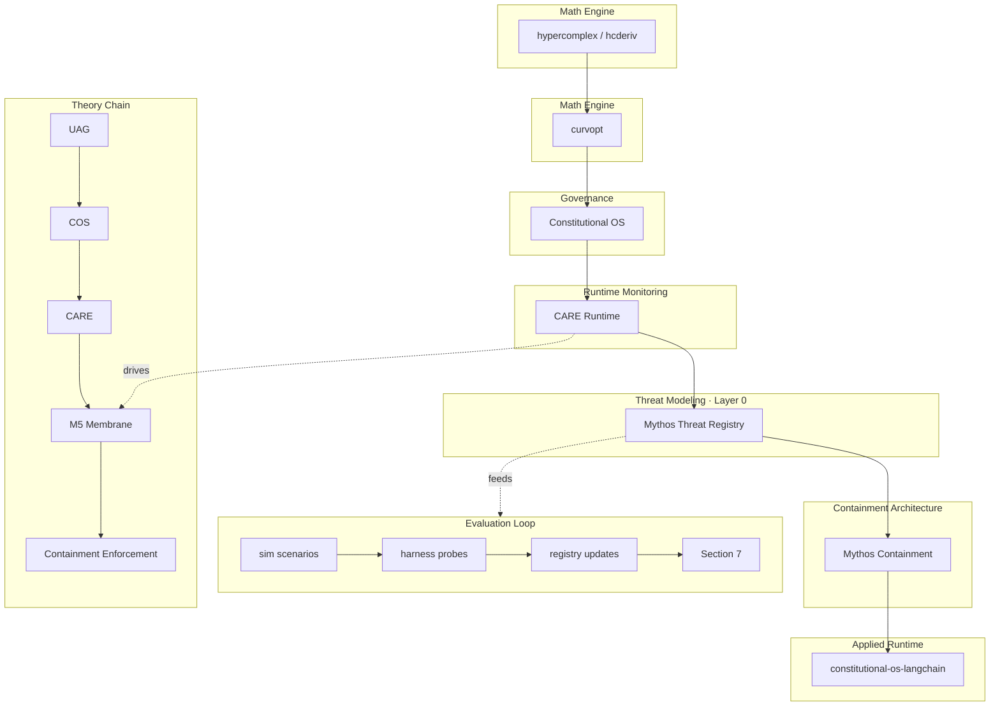

```mermaid
flowchart TD
    subgraph L1[Math Engine]
        HC[hypercomplex / hcderiv]
    end
    subgraph L2[Math Engine]
        CO[curvopt]
    end
    subgraph L3[Governance]
        COS[Constitutional OS]
    end
    subgraph L4[Runtime Monitoring]
        CARE[CARE Runtime]
    end
    subgraph L5[Threat Modeling · Layer 0]
        REG[Mythos Threat Registry]
    end
    subgraph L6[Containment Architecture]
        CONT[Mythos Containment]
    end
    subgraph L7[Applied Runtime]
        LANG[constitutional-os-langchain]
    end

    HC --> CO --> COS --> CARE --> REG --> CONT --> LANG

    subgraph Eval[Evaluation Loop]
        SIM[sim scenarios] --> HAR[harness probes] --> UPD[registry updates] --> SEC[Section 7]
    end

    subgraph Theory[Theory Chain]
        UAG[UAG] --> COS2[COS] --> CARE2[CARE] --> M5[M5 Membrane] --> ENF[Containment Enforcement]
    end

    REG -.->|feeds| Eval
    CARE -.->|drives| M5
```
